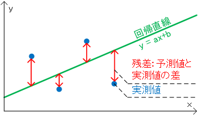
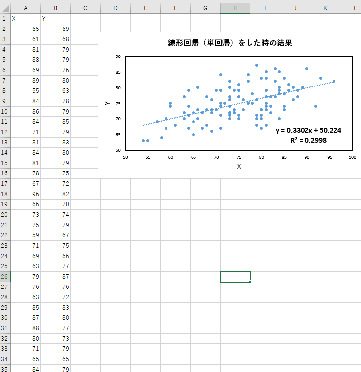

# 線形回帰（単回帰分析）を1から実装して理解を深めてみよう: つづき

この記事は、MATLABアドベントカレンダー（その2）の5日目の記事として書かれています。

[https://qiita.com/advent-calendar/2022/matlab](https://qiita.com/advent-calendar/2022/matlab)

# 1 はじめに

前回の記事では、以下のように、線形回帰（単回帰分析）を行った時の、式の傾きや切片の求め方についてまとめました。

例えば、以下の図では、y = 0.33x + 50.2 という式が得られています。この傾きや切片を、xとyのペアからどのように求めるか、ということでした。


具体的には、傾きは、


...(前回の記事の17)

であり、切片については以下の通りでした。


...(前回の記事の18)

しかし、文量が多くなってしまい、上の図中にあるような、決定係数 の求めかたについては、

触れられていませんでした。

そこで、本記事では、線形回帰（単回帰分析）をしたときの、決定係数の求め方について、簡単にまとめます。さらに、MATLABを用いてコーディングをし、ここでの理解による実装の結果と、MATLABのregress関数およびExcelの結果が一致することを確かめます。

本記事は、タイプミスや間違いなどがあるかもしれません。その場合教えていただけますと幸いです。

# 2 決定係数の求め方について

決定係数は、以下の図の、残差を利用して求めることができます。残差とは、予測値と実測値の差のことです。

この値が小さければ小さいほど、決定係数は高くなりそうです。では、具体的にどのような式で決定係数を求めるのか見ていきたいと思います。



画像出展：回帰分析における寄与率(=決定係数)と、残差や相関係数との関係

https://end0tknr.hateblo.jp/entry/20170521/1495364312

## 2.1. 偏差積和を用いた傾きと切片の式の展開
### 2.1.1. 傾きについて

以下のような、偏差積和を考えます。はxの平均です。yについても同様です。

各サンプルから、そのを引き算し、yについても同様の処理を行ったものとの積を求めます。それをサンプル全体に対して行い、和を取ります。


...(1)

偏差積和についてはより詳しい内容を知りたい方は以下のページをご覧ください。

[https://toukeigaku-jouhou.info/2017/06/24/variance-covariance/](https://toukeigaku-jouhou.info/2017/06/24/variance-covariance/)

(1)の中身を展開して、


...(2)

各項にばらして、

 

...(3)

 

xの和は、xの平均と個数を掛け合わせたものと等しいので、

 

...(4)

 

...(5)

となります。

Σの中に戻して、


...(6)

を得ます。

傾きの式の分子に相当することがわかります。


...(前回の記事の17)

次に、aの式の分母について考えます。

式(1)において、x = y であるとします。すると以下の等式が成り立ちます。


...(7)

式を整理すると、


...(8)

となります。この左辺の式はaの分母と等しいことがわかります。

そのため、aは以下のように書き換えることができます。


...(9)

偏差積和をのように表すとすると、


...(10)

のように表せます。

さらに、偏差積和をサンプル数で割ると、共分散になるため、


...(11)


...(12)

とすることができます。ここでは、共分散をのように表しています。

なお、式(10)から(12)にて扱ったような、共分散については以下のページがわかりやすかったです。

**共分散の意味と簡単な求め方**

[https://manabitimes.jp/math/853](https://manabitimes.jp/math/853)

### 2.1.2. 切片について

切片は以下のようになるのでした。


...(前回の記事の14)

aにさきほどの式(12)の結果を代入します。


...(13)

一項目と二項目を入れ替えます。


...(14)

$\frac{1}{N}\sum_{i\;=\;1}^N x_i \;=\;$ という関係であるため、

 

...(15)

であることが言えます。

これにより、傾きと切片の式がかなり見やすくなりました。

決定係数を求めるために、最後の準備を行います。

## 2.2. 平方和の分解

y = ax+bの式では、xが大きくなるほど、yの値もaxだけ大きくなります。もし、この回帰式が完全である場合、yの変動は、xの変動によって

完全にカバーすることができます。しかし、実際は、ノイズなどの影響で、完全な式は得られることはなく、そのxの変動では説明できない部分が発生してしまいます。この説明できない部分が小さいほどうれしいです。では、このxの変動によって説明される部分と、説明されない部分をどのように切り分けるとよいでしょうか。

はじめに、

 の平均回りの変動（平方和 ）は、説明変数  の変動によって説明される部分と、説明できない残差の平方和に分解することができます。

実際に計算していきます。 の平均回りの変動（平方和 ）は以下の通りです。

  


  

...(16)

y = ax+bという式で回帰しているため以下のように記述できます。


...(17)

展開して、


...(18)

ここで、式(18)の3つ目の項について考えます。


...(18)

前回の記事で、回帰残差の和はゼロになることを確かめました。

[https://kentapt.hatenablog.com/entry/matlabAdventDay4](https://kentapt.hatenablog.com/entry/matlabAdventDay4)

つまり、残差を以下のように定義したとします。


...(19)

すると、


...(20)

が成り立ちます。

さらに、同様に前回の記事で、

回帰残差とxの値はベクトルとして直交していることも確かめました。


そのため、式(18)は、


$$\;$$

...(19)

であることがわかります。そのため、この値は0になるため、式から除外します。

式(18)は以下のようになります。


...(19)

さらに、式(19)の1項目について考えます。


...(20)

同様に、前回の記事で、推定された回帰直線は、サンプルのxとyの平均を通ることを確かめました。

そのため、式(20)は以下のように書き換えることができます。


...(21)

この式を展開して、


...(22)

第三項目のを１つだけ展開します。

 であることを上で確かめました。そのため、


...(23)

であり、二項目と三項目を計算できます。


...(24)

この式の左辺の値（残差平方和）である、を${\;S}_e$とします。

すると、　　　    　　　　　　　　　　　　　　　　　　　　　　　　　　　　　　　　　　　　　　　　　　　　　　　　　　　　　　　　　　　　　　　　　　　　

...(25)

とすることができます。とすると、

　　

...(26)

です。

ここで、以下の式がもとになっていました。


...(19を再掲）

そして、

を${\;S}_e$とした場合、

　

である関係式を得ました。

この関係式を19に代入すると、

  


  

...(27)

であり、

　　　　　　

...(28)

となります。

ここで、と置いていました。

式(12)より、

 

...(29)

です。

## 2.3. 決定係数の式の定義

式(26)を振り返ってみます。　としたときの、は、目的変数yを二乗して足し合わせたもので、全変動を表しています。

また、は残差平方和でした。つまり、（全変動）＝（残差平方和）＋　

となっており、はデータの変動のうち、回帰直線によって表すことのできる量であると考えることができます。

そこで、決定係数を、全変動のうち、回帰直線によって表すことのできる割合であるとし、大きい（最大1）ほどよいものになります。

式で表すと、


...(30)

となります。式(26)を利用して、


...(31)

となります。

これにより、決定係数を計算するための式を得ることができました。

## 2.4. 決定係数と相関係数rの関係

式(30)を以下のように変形します。

相関係数は、xとyの共分散であるをxとyの標準偏差で割ったものであるため、


...(32)

このような関係式を得ることができました。単回帰分析の場合は、相関係数を2乗とすると決定係数になることがわかりました。

相関係数については、以下のページがわかりやすかったです。

https://rikei-logistics.com/soukan\#

# 3. MATLABとExcelを用いて、2章の決定係数の式が正しいか確認してみよう

ここで、2章の結果が正しいかどうかを、実際にコーディングして確かめてみます。以下の3つの結果が同じになるかを検証します。

   1.  MATLABのregress関数にて、単回帰分析を行った場合の決定係数の値 
   1.  Excelにて、単回帰分析を行った場合の決定係数の値 
   1.  MATLABにて2章の結果を1から書いて計算させたときの決定係数の値 

## 3.1. MATLABのregress関数にて、単回帰分析を行った場合の決定係数の値

```matlab:Code
load examgrades
```

yとXの値を設定します。

```matlab:Code
y = grades(:,5);
X = [ones(size(grades(:,1))) grades(:,1)];
```

regress関数で単回帰分析を行います。決定係数は0.2998でした。

```matlab:Code
[mdl,~,r,rint,stats] = regress(y,X);
disp(strcat('R2_MATLAB= ',string(stats(1))))
```

```text:Output
R^2=0.2998
```

## 3.2. Excelにて、単回帰分析を行った場合の決定係数の値

3.1にて用いたデータをコピーアンドペーストして、「近似曲線」の機能を用いて、

傾きと切片の値を計算しました。

3.1と同じ、決定係数の値が計算されており、まずは、3.1および3.2で、ソフトウェアの関数や機能にてうまく値が計算できたと思われます。



## 3.3. MATLABにて2章の結果を1から書いて計算させたときの決定係数の値

前回の記事で得た、


...(前回の記事の17)

および


...(前回の記事の18)

を用いてまずは、傾きと切片の値を計算します。

さらに、(30)のの値を計算します。

```matlab:Code
x = grades(:,1);
bunshi_a = sum(x.*y)-1/numel(x)*sum(x)*sum(y);
bumbo_a = sum(x.^2)-1/numel(x)*(sum(x)^2);
a = bunshi_a/bumbo_a;
b = -1/numel(x)*sum(x)*a+1/numel(x)*sum(y);
SR = sum((a*x+b-mean(y)).^2);
Syy = sum((y-mean(y)).^2);
R2 = SR/Syy
```

```text:Output
R2 = 0.2998
```

こちらも0.2988になり、正しいことがわかりました。

これらの結果から、2章の私の理解や、ここでのコーディングはおおよそ正しそうです。

# 4. 簡単なまとめ

   -  この記事では、線形回帰（単回帰分析）における、決定係数の計算方法についてまとめました。 
   -  MATLABとExcelを用いて、ここでまとめた決定係数の式が正しいことを確認しました 
   -  普段から何気なく使っている決定係数ですが、丁寧に求めて記事にまとめるのが大変でした。しかし、これまでより広い視点で線形回帰を使えそうな気がしました。 
   -  （全変動）＝（残差平方和）＋（データの変動のうち、回帰直線によって表すことのできる量）という関係式を求め、決定係数の計算をしました。しかし、この式の導出は飛ばして、公式のような形で決定係数の定義を覚えて、決定係数の計算をしてしまってもいいかもしれません（？） 

# 5. 参考文献（本文中に記載のないもの）

**回帰直線の式を最小二乗法により計算する**

[https://ictsr4.com/py/r0131.html](https://ictsr4.com/py/r0131.html)

**永田靖、棟近雅彦共著：多変量解析入門**

[https://www.amazon.co.jp/%E5%A4%9A%E5%A4%89%E9%87%8F%E8%A7%A3%E6%9E%90%E6%B3%95%E5%85%A5%E9%96%80-%E3%83%A9%E3%82%A4%E3%83%96%E3%83%A9%E3%83%AA%E6%96%B0%E6%95%B0%E5%AD%A6%E5%A4%A7%E7%B3%BB-%E6%B0%B8%E7%94%B0-%E9%9D%96/dp/4781909809](https://www.amazon.co.jp/%E5%A4%9A%E5%A4%89%E9%87%8F%E8%A7%A3%E6%9E%90%E6%B3%95%E5%85%A5%E9%96%80-%E3%83%A9%E3%82%A4%E3%83%96%E3%83%A9%E3%83%AA%E6%96%B0%E6%95%B0%E5%AD%A6%E5%A4%A7%E7%B3%BB-%E6%B0%B8%E7%94%B0-%E9%9D%96/dp/4781909809)
